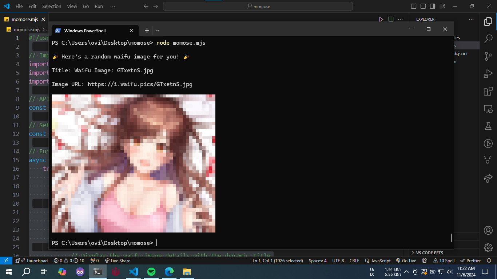

#### **momose** is a fun CLI tool that brings random waifu images straight to your terminal! Fetch a new waifu every time you run it and display it in style. Perfect for anime lovers who want a little extra flair in their terminal.



## 🔧 Requirements

- Node.js (v14 or above)
- npm (v6 or above)

## 📦 Installation and Usages

```bash
npm i -g momose
```

```bash
momose
```
Type **momose** to view a random AnimeWaifu image on terminal.

## 📜 License

[MIT](LICENSE)

## 💡 Contributing

Got ideas or improvements? Fork, tweak, and send us a pull request! 😁